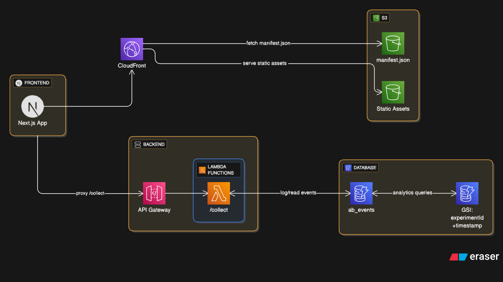

# AB Testing Tracker

Lightweight AB testing tracker with a Next.js frontend, serverless backend, and AWS infrastructure (S3, CloudFront, Lambda, API Gateway).

## Write up
[Putting AWS Skills to Work: Building an AB Testing Tracker](https://forem.com/ajithmanmu/putting-aws-skills-to-work-building-an-ab-testing-tracker-34c)


## Structure

```
ab-testing-tracker/
├── frontend/   # Next.js app for variant rendering
├── backend/    # Lambda handlers & serverless config
├── infra/      # Terraform for S3, CloudFront, Lambda, API Gateway
```

## Features

* **Next.js Frontend** – Renders variants based on manifest.json from S3/CloudFront
* **Serverless Backend** – Handles event logging and stats retrieval
* **Infrastructure** – Terraform-managed AWS stack (S3, CloudFront, Lambda, API Gateway)

## Prerequisites

* Node.js 18+
* AWS CLI configured
* Terraform installed

## Commands

**Run frontend**

```bash
cd frontend
npm run dev
```

**Run backend**

```bash
cd backend
npm run dev
```

**Deploy backend**

```bash
cd backend
npm run deploy
```
## Architecture




## API Endpoints

Base URL depends on deployment:

* **Local**: `http://localhost:3000/collect` (via `serverless offline start`)
* **Production**: API Gateway Invoke URL from `serverless deploy`

---

### 1️⃣ Log Impression

```bash
curl -X POST https://<BASE_URL>/collect \
  -H "Content-Type: application/json" \
  -d '{
    "action": "log_impression",
    "experimentId": "cta-color-001",
    "userId": "u1",
    "variant": "A"
  }'
```

---

### 2️⃣ Log Click

```bash
curl -X POST https://<BASE_URL>/collect \
  -H "Content-Type: application/json" \
  -d '{
    "action": "log_click",
    "experimentId": "cta-color-001",
    "userId": "u1",
    "variant": "A"
  }'
```

---

### 3️⃣ Get Stats

```bash
curl -X POST https://<BASE_URL>/collect \
  -H "Content-Type: application/json" \
  -d '{
    "action": "get_stats",
    "experimentId": "cta-color-001"
  }'
```
